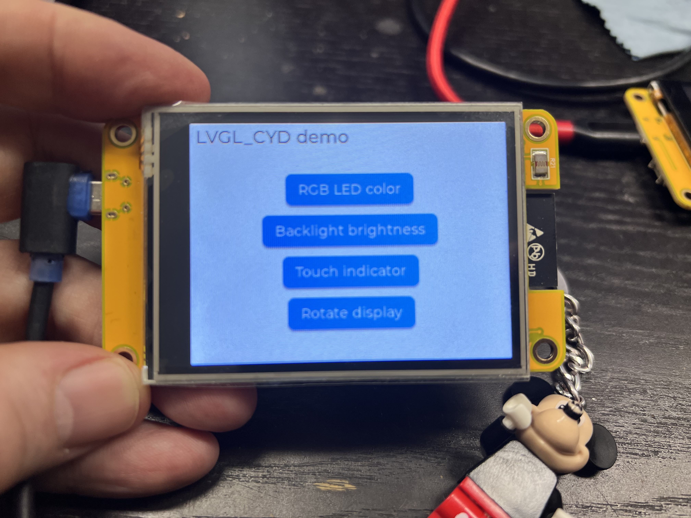

# LVGL_CYD

***Using the "Cheap Yellow Display" with LVGL graphics library.***



## Introduction

There is a cheap brandless ESP32 circuit board that comes with a 320 x 240 LCD display with touch that a number of Chinese businesses seem to be selling, also via AliExpress and Amazon. There's a number of variants, some with capactive and some with resistive touch screens, some with 2.8" display some with 2.4" display. The 2.8" resistive touch version might be called the "ESP32-2432S028R", with the part number ending indicating screen size and touch method. (So 24C would indicate a 2.4" screen and capacitive touch sensor.) These displays cost about €/$ 15 including shipping, so they're really good value for money. For lots more information on them, as well as links where to buy, I highly recommend [this GitHib page](https://github.com/witnessmenow/ESP32-Cheap-Yellow-Display). Since the solder mask on the circuit board is generally yellow, that GitHib page also coins the name Cheap Yellow Display (CYD), which I'll use also.

Other than being cheap and available, this board is not particularly special in that all the components should be familiar to people that have played with similar hardware: both the screen and the touch interface use chips that are very common, and anyone with some time on their hands should be able to make it work with available software and information, e.g. via links from the GitHub page mentioned above.

This Arduino library is called LVGL_CYD and it exists to make life easier for people wanting to code for the display using the [Light and Versatile Graphics Libary. (LVGL)](https://lvgl.io/).

&nbsp;

* **Auto detects board variant** at runtime: same code works on a number of these boards.
    * Won't work on all the more obscure versions, but does on the variants I have had my hands on. See below for details.
* Has modified **touch drivers included** for both capacitive and resistive touch screens and settings optimized for this hardware.
    * **Resistive touch works better** because I modified the driver to poll only and set slightly lower pressure threshold.
    * **Self-contained**. No setting up drivers, messing with lots of files, apart from modifying one config file (see below) it all works out of the box.
* **Hides complexity**. Startup boilerplate code for display and touch all in `LVGL_CYD::begin()` function.
* Startup takes rotation as argument, optionally in `USB_LEFT` format. **No more guessing which way display will face**.
* Functions to set color and brightness of built-in **RGB LED** and brightness of **LCD backlight**
* **Clear well-documented examples**, one shows a simple but complete multi-screen interface that may be a good starting point for your own work.

&nbsp;

## Getting Started

### Install board and libraries

In the Arduino IDE, under 'Boards', install Espressif's support for the ESP32. In the board selection box at the top of the screen, look for "CYD" and select ESP32-2432S028R" as the board. Then install this library by searching for 'LVGL_CYD'. The IDE should then automatically install TFT_eSPI and LVGL if they aren't installed already.

> [!NOTE]  
> Some users have [reported](https://github.com/ropg/LVGL_CYD/issues/1) that my library [`spi_lcd_read`](https://github.com/ropg/spi_lcd_read), which this library depends on, does not get installed automatically even though it is listed as a dpendency. If that does not install together with this one, you can install it manually.

### Setting up LVGL with `lv_conf.h`

#### copy file

Copy the file `lv_conf_template.h` from the lvgl library directory to `lv_conf.h` in the Arduino libraries directory. **Note that it should sit next to and not inside the LVGL library directory.** On my Mac, I would do this as follows:

```
cd ~/Documents/Arduino/libraries
cp lvgl/lv_conf_template.h lv_conf.h
```

#### enable config file

Edit this `lv_conf.h` with a text editor and find the line (towards the beginning) that says:

```
#if 0 /*Set it to "1" to enable content*/
```
and indeed change the `0` to a `1`.

#### screen

Find the line (towards the end) that reads:

```
#define LV_USE_TFT_ESPI         0
```
and change the `0` on that line to a `1`.

#### fonts

Find the defines called `LV_FONT_MONTSERRAT_` followed by a number, and change their `0` into a `1`. You can leave out some of these if you want to save memory, but you probably have plenty in the ESP32 module. Note that the demo example that comes with this library uses the `LV_FONT_MONTSERRAT_18` font.

#### (optional) logging

For development, I recommend turning on logging so you can see why something is not working in LVGL. For this set `LV_USE_LOG` and `LV_LOG_PRINTF` to `1`, and set `LV_LOG_LEVEL` to `LV_LOG_LEVEL_WARN`.

#### save

Then save the file and you're good to go.


### Try example

Now plug in your board and select the CYD on the serial port (`/dev/cu.wchusbserial210` on my Mac). Then go to 'File / Examples' and find the examples for this library in the list. The 'simple_button' example looks like this:

```cpp
// Including this library will also include lvgl.h and TFT_eSPI.h 
#include <LVGL_CYD.h>

void setup() {
  
  // Start Serial and lvgl, set everything up for this device
  // Will also do Serial.begin(115200), lvgl.init(), set up the touch driver
  // and the lvgl timer.
  LVGL_CYD::begin(USB_LEFT);

  // Create single button in center of active screen
  lv_obj_t * button = lv_button_create(lv_scr_act());
  lv_obj_align(button, LV_ALIGN_CENTER, 0, 0);

  // Put text in button
  lv_obj_t * button_label = lv_label_create(button);
  lv_label_set_text(button_label, "Oh yeah?");

  // Set a callback to print to serial port when button is clicked.
  //   For those unfamiliar: The "[]() ->" thing is an "anonymous function". It lets
  //   you define a function in place instead pointing to one named elsewhere.
  lv_obj_add_event_cb(button, [](lv_event_t * e) -> void {
    Serial.println("Hell yeah!");
  }, LV_EVENT_CLICKED, NULL);

}

void loop() {

  // lvgl needs this to be called in a loop to run the interface
  lv_task_handler();

}
```

If you've have already used LVGL you'll see this is very straightforward, everything should 'just work'. If you need help understanding the above, the [LVGL website](https://lvgl.io) is a great starting point. Next, try the other example, which should demonstrate more functionality from this library.

&nbsp;

## Quick Reference

```cpp
void LVGL_CYD::begin(lv_display_rotation_t rotation = USB_DOWN);
void LVGL_CYD::backlight(uint8_t brightness);
void LVGL_CYD::led(uint8_t red, uint8_t green, uint8_t blue, bool true_color = true);
bool LVGL_CYD::capacitive;
bool LVGL_CYD::resistive;
int16_t LVGL_CYD::pressure;
TFT_eSPI * tft;
```

&nbsp;

## The Details

### CYD variants

Currently, CYD detection in this library functions as follows:

1. If the capactive touch chip used in the CYD capacitive variants is detected on the I2C bus, we assume the display has its backlight on GPIO27.

2. Otherwise, it assumes the backlight is on GPIO21 and it checks if a resistive touch chip is detected (if something is pulling up the IRQ line).

3. Only if one of the touch chips is detected, an LVGL input device is created and configured.

If I learn of more variants that need to be treated differently, I'll see if they can be differentiated from these variants automatically and adjust the code accordingly. Pull Requests or complete reports with differences and ideas on how to detect are appreciated.

`LVGL_CYD::capacitive` and `LVGL_CYD::resistive` are boolean values that you can read if your code needs to know which variant was detected.

### Screen

#### different CYD variants

I have four different variants of the CYD:

* the 'regular' 2.8" resistive touch variant with micro-USB
* a 2.8" capacitive touch variant with USB-C connector
* a 2.4" capacitive touch variant with USB-C and
* a 2.8" resistive touch variant with both USB-C and micro-USB.

The capacitive 2.8" and the thing with the two USB connectors have ST7789 instead of ILI9341 as display controller. It works with the standard TFT_eSPI (ILI9341) settings, my library just needs to invert the colors on the display and do a [fix](https://github.com/witnessmenow/ESP32-Cheap-Yellow-Display/blob/8ec3f68fce48363ffa1aea607b329e1412ac11c7/cyd.md#the-display-doesnt-look-as-good) to the gamma curves. That's why my code reads a register on the display to see if it's an ILI9341, and if not it assumes it's an ST7789. 

#### talking to display directly yourself

`LVGL_CYD::tft` is a convenience pointer to the `TFT_eSPI` screen object if you need ever to talk to the display directly, meaning without LVGL in-between.

### Touch

#### resistive

For the XPT2046 resistive touch chip, I took, stripped and simplified the code from [Paul Stoffregen's XPT2046 Arduino library](https://github.com/PaulStoffregen/XPT2046_Touchscreen). I found that taking out the code that waits for the IRQ signal and simply polling the chip works better: more touches are detected. Looks to me like even touches that meet the set pressure threshold sometimes do not signal the interrupt, somehow. Then I lowered the pressure threshold a bit and that made it work a little smoother still. Certainly better than I expected from resistive touch.

It's not linear, nor repeatable, but if you have a use for the touch pressure currently sensed, it is in `LVGL_CYD::pressure`.

#### capacitive

The capactive touch code simply reads the data from the CST820 chip via I2C. Totally usable, but I'm not 100% happy with how the coordinates map to where your finger actually is, especially around the edges. I might add some bespoke code for minor adjustments later.

### RGB LED

To turn on the RGB LED, use `LVGL_CYD::led(red, green, blue)`, where the color values are 8-bit integers. The colors are corrected to true color, because otherwise the red and (to a lesser extent) the blue LED would be too bright. To turn this feature off and show the full brightness of each LED, pass a fourth argument and set it to `false`.

### Backlight

Set the backlight brightness with `LVGL_CYD::backlight(brightness)`, where brightness is an 8-bit integer.

&nbsp;

## Good To Know

### LDR / Light Sensor

There is a light sensor on the board, and naturally I wanted an 'auto' setting for the backlight. Sadly the sensor is useless as it is. You can read a value with `analogRead(34)`, but that value is always zero unless it is truly pitch dark. The yellow board makes a good light guide for the display backlight so that even if you do a [hardware mod](https://github.com/hexeguitar/ESP32_TFT_PIO#1-ldr) to bring the value in a more sane range, it may still not suit your needs.

### USB-C

The USB-C port on the capacitive units is not wired correctly (it doesn’t have the resistors on the CC lines), so that on direct connection to most computer USB-C ports the CYD will not power up. Simplest solution is to use a USB-C to USB-A converter and then a USB-A to USB-C cable.
